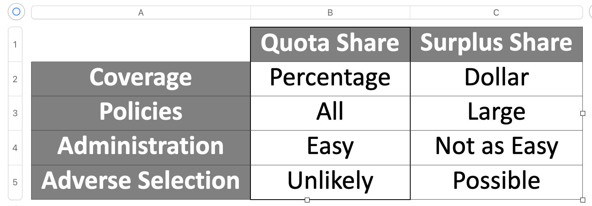

# Risk
uncertainty about outcomes, with the possibility that some of the outcomes can be negative -- uncertainty about type and timing.
* Pure (neutral or negative) or speculative (possible gain), subjective or  objective, diversifiable or nondiversifiable, 
* Subjective risk assessment generally overemphasizes severity and underemphasizes frequency
 * Financial consequences of risk: Expected costs of losses or gains (directo or indirect), expenditures on risk management (premiums, ...), cost of residual uncertainty (sales lost, interest rate hikes)
* Loss exposures: situations or conditions that expose assets to loss. 3 components: an asset, a peril (hazards such as moral, morale, physical, legal), and financial.  Instances include property, liablility, personnel, net income.
* Management techniques: Risk control (avoidance, loss prevention, loss reduction, separation, duplication, diversification), risk financing (retention, transfer)

# Insurance as Risk Management
Pooling: lack of perfect correlation allows for reduced sd.
* Is risk sharing, while insurance is risk transfer.  Insurance can't ask members for more funds.  Insurer has funds to cover losses, called surplus (from capital investments and retained profits)
* Benefits: pay for losses,  manage cash flow uncertainty, meet legal requirements, risk control, efficient use of resources, Insured's Credit, Investment funds source, reduce social burdens.
*  Ideally Insurable Exposure: Pure Risk, Fortuitous Losses (random), Definite & Measurable, Large # of similar exposure units, independent & not catastrophic, affordable (limits on freq. and sev.)
* Gov't insurance: Fill unmet needs, compel insurance purchase, obtain efficiency & provide convernience, social purpose. Examples: NFIP, TRIP, FAIR, CEA

# Regulation
* Classification: ownership type, place of incorporation, licensing status, insurance distribution systems & channels
* Ownership forms: Proprietary (stock, Lloyd's of London & American Lloyds, Insurance Exchanges), Cooperative (Mutuals, Fraternal Organiztions), Other Co-ops (captives, RRGs, Purchasing Groups), Other (pools, gov't)
* Place of Incorporation: Unincorporated (Insurance Exchanges, Lloyd's), Domestic (in state), Foreign (out of state), Alien (other country).
* Licensing: "Admitted" if licensed, meet minimums for surplus & compliance. Else "Unadmitted."
* Sellers of insurance can only work with admitted insurers, except surplus lines brokers.
* Reinsurance accounting depends on "admitted" status of reinsurer.
* Distribution system: Independent agency/brokerage, direct writer, exclusive agency.
* Insurer goals: earn profit, meet customer needs, comply with legal requirements, diversify risk, fulfill duty to society.
* Constraints: Internal constraints (efficiency, expertise, size, financial resources, brand reputation), and External (Regulation, rating agencies, public opinion, competition, economics, insurane marketing and distribution)

# Underwriting
* Purposes of Underwriting: profitable book of business, weed out adverse selections, ensure adequate ph surplus, enforce underwriting guidelines
* Adequate Policyholder's Surplus: Surplus is admitted assets minus total liabilities. Limited to 3-1 premium-to-surplus.  Underwriters maintain premium side of ratio.
* Line Underwriting Activities: select insureds, classify and price accounts, recommend or provide coverage, manage a book of bus., support producers and insureds, and coordinate with marketing.
* Classify & price accounts: personal lines: assigning premiums & surcharges based on filed rates.  Commercial lines: apply judgement to evaluate each policy on its own merits, using filed rates as a starting point.
* Recommend or provide coverage: determine the insured's needs, make modifications for less desireable applicants, explain coverage provided, suggest endorsements to provide all desired/needed coverage.
* Staff underwriting activities:
    * Research the market: Add new products, retire old products, expand into new states, withdraw from current states, ensure desired mix of business in book, manage premium volume.
    * Formulate underwriting policy
    * revise underwriting guidelines,
    * evaluate loss experience,
    * research & develop coverage forms: work with legal (wording), work with actuarial (pricing), revise forms after lawsuits or catastrophes.
    * review & revise pricing,
    * arrange treaty reinsurance,
    * assist others w/ complex accts,
    * conduct underwriting audits,
    * participate in industry associations,
    * conduct education and training.
* UW Constraints
    * Financial Capacity:   maintain premium-to-surplus ratio.  Follow stat accting rules, select most profitable lines or accounts.
    * Regulation: insurers must be licensed in each state,
      * Rates, rules & forms must be filed with regulators
      * Some states require filing of underwriting guidelines
      * Regulations may force insureres to accept exposures they might not prefer
    * Personnel: need line expertise, need programmers,
    * Reinsurance: Availability affects insurer's capacity, reinsurers are wary of new or unique products
* Underwriting Guidelines: provide for structured decisions, ensure uniformity and consistency, synthesize insights & experience, distinguish between routine & non-routine decisions, avoid duplication of effort, adhere to reinsurance treaties and planned rate levels, support policy preparation and compliance, procide a basis for predictive models.
* Underwriting alternatives: accept a submission, reject the submission, accept with modifications (cancelling is HARD)
* Measuring Results: Combined Ratio = (Incurred Loss)/(Earned Premium) + (UW Expenses)/(Written Premium)
  *  Does not include investment income
  *  Can be distorted by unusual or rapidly changing circumstances.
* Nonfinancial measures: Selection / Product or line of business mix, pricing accuracy, accommodated accounts, retention ratio, hit ratio.
  
# Claims
* Claim function goals: Comply with contractual promise  & Support financial goals
  * Contractual promise: pay, defend, or indemnify in the event of a covered loss
    * Provide fair, prompt, equitable service to the policyholder
    * For insurer, claims are routine & expected, while for insured, emotionally & financially devastating
  * Support insurer's financial goals: Achieve underwriting profit by controlling expenses and only paying legit claims (covered by policy, not fraudulent)
  * Reconcile goals: how do goals contradict each other? Pay too much => higher loss ratio, premiums.  Pay too little => angry customers lawsuits, regulatory oversight, bad pr.
* Marketing implications: marketing uses claim info on customer satisfaction, settlement speed, and product development to fix coverage 'holes'
* Underwriting claim info usage: Claims adjusters inspect the property and may notice aspects of the insured property that affect loss or severity but are not accounted for, were misrepresented or omitted on the application (dogs), point to patterns of loss that imply classification needs to be modified (adverse selection)
* UW must make sure that Claims understands insurance coverages properly (eg. overflow)
* Actuarial use of claim info: Loss ratios used in ratemaking.  Judge adequacy of reserves (case, development, IBNR).  Salvage & subrogation costs inputted into LR calculation.
* Claims interation with public: claims reps must get details of the loss, act as the public face of the company, and manage expectations re: coverage.  
* Claim handling: acknowledge & assign the claim, identify the policy and set reserves, contact insured or their rep, investigate & document the claim, determine cause of loss, liability, and the loss amount.
  * The policyholder is obligated to mitigate further damage to the property.  The insurer will pay up front for supplies to do so.  Insurer may set up a time for an adjuster to inspect the damaged property.
  * Identify the policy and set reserves: Identify the policy in force on date of the loss.  Can be difficult (asbestos).  Peril may not be covered.  Verify that the policyholder fulfilled their contractual obligations.
  * Send nonwaiver agreement or reservation of rights letter in case the investigation turns up facts that might lead to denial.
  * Determine the cause of loss, liability, & loss amount: subrogation is recovery of some of losses paid to policyholder by party responsible for the loss.
  * Conclude the claim: check written, possibly after negotiation, arbitration, or mediation.  Litigation is worst-case (lawyers expensive, suing injured ppl is bad pr)

# Claims 2
* Insurable Interest: anyone financially harmed by destruction of the asset.  Sole owner, joint owner, ownership in common, lessees, bailees / carriers, security interest (bank providing mortgage)
  * Multiple parties can have insurable interest in the same asset: building owner & apt lenant.
  * Important because paying a claimant more than the value of their insurable interest can encourage intentional losses or insurance fraud
* Covered causes of loss: direct loss: damage to property caused by covedred cause of loss with no intervening cause.  Indirect loss - losses suffered as a result or consequence of a direct loss (without a direct loss, can be no indirect loss.  example: lost income)
* Excluded causes of loss: Nonphysical causes of loss such as obsolescence or reduced market value are not covered by insurance.  Also: Gradual causes of loss, and ordinance or law.
  * Faulty design, construction, or material: a policyholder might receive coverage, with subrogation from the liable party.  Intentional acts of the insured are also excluded.
  * Monetary value of loss: Replacement cost. Actual cash value typically paid up-front, with difference between that and replacement cost paid after repair complete.
  * Actual cash value: ACV = RCV - depreciation.  Market price usually considered fair value.  home & other structures insured at replacement, contents covered at actual cost, with endorsement for replacement cost.
* Insured's duties: provide prompt notice, protect property, assist with the loss adjustment process, provide proof of loss, submit to examination under oath.
* Procedures to conclude claim: determine & document cause & amount of loss.  Determine salvage & subrogation.

# Reinsurance Notes
* Basic terms: reinsurance, primary insurer (the reinsured, ceding company, cedent, direct insurer), reinsurer, retention, reinsurance premium, ceding commission, retrocession (retrocedent, retrocessionaire)
* Functions of reinsurance: Increase large-line capacity
  * line - max amt of insurance or limit of liability that an insurer will accept on a single loss exposure.
  * net insurance on any single loss exposure cannot exceed 10% of policyholder surplus. Reinsurers reduce net insurance by accepting liability.
* provide catastrophe protection: assign claims appropriately (direct losses, ensuing damage, interpreting forms), limited scope in time & area
* stabilize loss experience: volatile loss experience can change credit ratings, skew performance metrics, hurt company morale.  Smooth out highs and lows in loss experience by limity liability for single exposure, several loss exposures affected by a common event, and aggregate liability for a time period.
* provide surplus relief: statutory accounting limits premium to 3x surplus. Expenses (ceding commissions) are recognized immediately, while premiums are recognized as they are earned.
* facilitate withdrawal from a market segment: normal withdrawal options: 'run-off', cancewl all policies & refund unearned premium, purchase portfolio reinsurance (reinsurer accepts all liability, primary insurer deals with the paperwork and service), or novation (substitution of one insurance company for another.  Transfers all obligations.)
* provide underwriting guidance: Reinsurers work with a wide variety of insurers on a wide variety of lines (client confidentiality is important)
* Sources of reinsurance: professional reinsurers, reinsurance departments of primary insurers, reinsurance pools, syndicates, and associations.  Admitted (licenced in state) vs non-admitted (surplus lines only).
* Professional reinsurers: can be direct or through intermediary.  - Direct: fewer reinsurers in program.  - Intermediary (broker): often more than one reinsurer. can help secure high coverage limits.  Access to various reinsurnce solutions. Usually competitive rates.  - Relationship is 'utmost good faith'
* Primary Insurer's reinsurance department: 'firewall' between primary andreinsurance.  Includes intragroup agreements.
* Reinsurance Pools, Syndicates, and Associations
  * Pool - policy for full amount issued by member; reinsured by other members following agreed upon percentages.
  * Syndicate - Each member shares the risk with other members by accepting a percentage.  collectively constitute a single, separate entity.
  * Association - Blend of reinsurance and risk sharing
* Types of reinsurance:
  * Treaty:  Most require that all eligible exposures be ceded.  Pro Rata: quota share, surplus share. XS of loss: per risk (per policy), per occurrence (catastrophe), aggregate (stop loss)
  * Facultative: Reasons are capacity, concentration, unique, and excludeed.  Types are pro rata and XS of loss.
* Ceding commission:  flat -  fixed percentage with no adjustment. Profit-sharing - contingent on reinsurer earning greater than expected profits.  Sliding scale - adjusts commission based on profitability of agreement.

  
* Excess of Loss: * Attachment point = Deductible.  * Co-participation = Coinsurance.  * [Limit] xs [attachment].  Usually no ceding commission, may be profit sharing.  LAE can be 'pro rata in addition' or 'included in the limit' * Inflation affects layers differently.
  * Types of XOL re: per risk, per policy, catastrophe, per occurrence (extracontractual damages), aggregate.
  * Capital market alternative: catastrophe bond), catastrophe risk exchange, contingent surplus note, Industry loss warranty, catastrophe option, line of credit, sidecar (spv).
      
* Increase large-line capacity

# Homeowners Property Coverage
* Coverage A: Dwelling (bldg policyholder lives in)
* Covg B: Other structures ( Garages, sheds, etc. 10% of Cov A for HO-3).
* Coverage C: Contents. Policyholer's 'stuff'. (For HO-3, 50% of Cov A)
* Coverage D: Loss of Use.  Hotel & restaurant bills while a house is under repair.  Also, lost rental income (for HO-3, 20% CovA)
 * Cov E: Personal liability.  Covers certain amts policyholder becomes legally obligated to pay because of bodily injury or property damage.
 * Cov F: Medical Payments to others.  Pays for medical treatment of people who are not residents.  Does not require legal responsibility for payment
   * To A person at the insured loction who has permission to be at the insured location
   * To a person away from the insured location due to conditions at the insured location
   * to a person away from the insured location by an activity performed by an insured.
* Additional Coverages
  * Claim Expenses: legal representation, bond premiums, travel expenses, loss of earnings, post judgment interest. - First Aid expenses. - Damage to property of others (up to \$1,000) regardless of liability.  Loss assessment - up to \\$1,000 for costs - passed on from an association to members.
* Coverages: Perils
  * "Named Exclusion" or "Special" coverage is a blacklist of uncovered prerils.  Any other cause of loss will be covered.
      * typical exclusions: Collapse - Freezing of plumbing, heating, AC,  or a household appliance - Freezing, thawing, pressure, or weight of water or ice - Theft of construction materials - Vandalizm and Malicious Mischief for vacant dwellings - Mold, fungus, or wet rot - Natural deterioration - smoke from agricultural smudging or industrial operations - Pollutants - settling of the dwelling - Animals
  * "Named Peril" is also called "Broad" coverage.  It is a whitelist of perils, and only perils listed are covered
    * Typical Coverage C named perils: Fire or Lightning - Windstorm or Hail - Explosion - Riot or Civil commotion - Aircraft - Vehicles - Smoke - Vandalism - Theft - Falling objects - weight of ice, snow, or sleet - accidental discharge or overflow of water/steam - sudden and accidental tearing apart, etc. - Freezing - Sudden and accidental damage from artificially generated electric current - Volcanic eruption
* Coverages: Exclusions
  * Some perils are excluded for any Section I coverage. Some of these can be altered by endorsements. See pages 6.22 through 6.24 for additional detail.   Typical exclusions: ordinance or law, earth movement, water, power failure, neglect, war, nuclear hazard, intentional loss, governmental action.
* ISO Forms: HO-2 Broad Form (Provides named perils coverage for dwellings, other structures, and personal property) - HO-3 special form: Special coverage on dwellings, other structures, and personal property - HO-8 Modified coverage form: Provides limited named perils coverage for dwellings, other structures, and contents.  Damage covered on functional replacement cost basis - Forms 2, 3, 5, and 8 are only for owner-occupants of non-farm dwellings - HO-4 Contents Broad Form: named perils coverage for personal property, no coverage for dwelling or other structures.  Designed for tenants. - HO-6 Unit-Owners Form: Coverage for personal property on named perils basis, with limited dwelling coverage.  Designed for condos and co-ops.
* Endorsements: Allow policyholders to customize contract by increasing or decreasing limits, adding or removing coverage, or changing definitions. -Some favorites: HO-04-90: Personal Property replacement cost - HO-00-15: special personal property - HO-04-54: Earthquake - HO-04-65: Coverage C increased special limits - HO-24-82: Personal injury - HO-04-95: Water backup and sump overflow

# Exposures - W & M ch4
* Exposure basis gives simple way to measure amt of risk in a policy.
* Exposure vs rating variables: Beer: bottles  vs brand - fruit: pounds vs variety
* Criteria for exposure bases: good exposure base should be directly proportional to expected loss, practical, and consider any preexisting exposure base established within the industry.
* Criterion: proportional to expected loss.  All else being equal, the expected los sof a policy with two exposures sjould be twice the expected loss of a similar policy with one exposure - The factor with the most direct relationship to the losses should be selected as the exposure base.
* Criterion: Practical - the selected base should be objective and relatively easy and inexpensive to obtain and verify - Ideally would be difficult for policyholders or agents to falsify exposure information for their own benefit.
* Criterion: Historical precedence: A more accurate or practical exposure base may be discovered/invented/proposed - Historical data uses the old base - potential large swings in premium for existing customers - change in rating algorithm.
* Aggregation of exposures: Time-frame: calendar year vs policy year - Exposures: Written, Earned, Unearned, or In-Force.
* Exposure Trend: Some exposure bases grow over time (e.g., with inflation) - This makes comparing years complicated - Can lead to rising premiums.

# Classification W&M ch9
* Why  classification?:  Loss experience data is the most important part of the ratemaking process. - Some commercial products might provide enough data to rate themselves - Personal products never have enough on their own, so must be grouped with similar risks and rated as a class.
* Classification process: determine which characteristics of the exposures split them into groups with similar expected loss experience.  Find indicated rage relativity for the different groups.  Goal is to charge the 'right' amount of every individual risk, not just the 'right' amount in aggregate.
* Why risk specific premium, vs aggregate premium?
  * Adverse selection begins when one insurance company is classifying risks more accurately than another
  * The company with inadequate classification finds its customer base shifting towards riskier customers, its loss ratio increasing, and it is unable to fix the problem by raising rates.
* Evaluating rating variables: a rating varialbe must be evaluated on criteria in four categories: statistical, operational, social, and legal
* Statistical criteria: Statistical significance, homogeneity, credibility.  Actuary must balance homogeneity and credibility.  More classes means risks within each class are more similar, but there are less of them to produce significant results.
* Operational criteria: Objective, inexpensive to administer, and verifiable (hard to manipulate by insured or distribution channel)
* Social criteria: Affordability - Causality: policyholders and DOIs like it better when there is a clear reason why a variable would affect losses. - Controllability: preferred for the insured to be able to change their class through risk management - privacy concerns
* Legal criteria - In the US, states regulate - legally ideal insurance rates: 'not excessive, not inadequate, and not unfairly discriminatory' - some states restrict use of particular variables' use in rating or underwriting.

# Credibility - W&M Ch12
* Buhlmann Credibility: EVPV = expected value of process variance (within-group variance) -- VHM = variance of hypothetical means (variance between groups) -- N = number of observations -- K = EVPV/VHM -- Z = N/(N + K)
  * Marksman example: four marksmen, four targets: given a bullet hole, can you tell which marksman fired it?
* Bayesian credibility: very math-y
* Complement of credibility: This is the 'other' data, which receives a weight of (1-Z).  Desirable qualities: accurate, unbiased, statistically independent, available, easy to compute, logical relationship to base statistic.
* Commonly used complements: loss costs of a larger group that includes the group being rated - loss costs of a larger related group - rate change from the larger group applied to present rates - harwayne's method - trended present rates - competitor's rates

# Other Considerations
* Just because a rate indication tells us we need a rate indication tells us we need an x% change in premiums doesn't mean that will happen, due to: regulatory, operational, and marketing constraints/considerations.
*  Regulatory constraints: Insurance is regulated by the states.  Regulation is tighter for personal lines & lines where individuals are the beneficiaries than for commercial lines.  Rule & rate regulations: can be classified from most to least restrictive: mandated rates, prior approval, file & use, use & file, open competition.
*  Sometimes a limit may be placed ont the maximum overall premium change, or on the maximum change for any one policyholder.
  * Could be forbidden or might require written notice or public hearings.  Why would those actions be required? If there is a limit, how do those insurers react?
  *  Some jurisdictions may restrict rating variables that can be used.
* Insurance response to Regulatory presures: Legal action - revise UW guidelines, restricting customers for whome adequate rates are not allowed - Change marketing tactics to avoid undesireable customers - find a proxy for a disallowed variable.
* Operational constraints: constraints due to limitations of personnel, hardware, or software.  The IT dept is always busy: changing an existing value is easy.  changing the steps or their order is hard.  Adding a new variable is hard.
* Marketing considerations: Raising premiums increases profits until consumers start using substitute goods. It is nearly impossible to discover the demand elasticity of an insurance policy.  The best we can do is use standard metrics: hit ratio (a.k.a. close ratio / conversion rate), retention ratio, win ratio, istributional analysis, policyholder disclocation analysis
* 
  
    

 
      
    
  

    

    
    
    