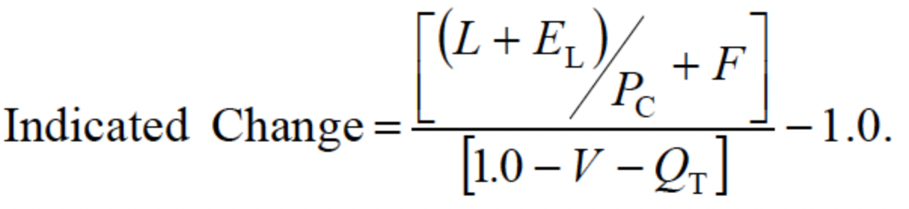

# Claims
* Claim function goals: Comply with contractual promise  & Support financial goals
  * Contractual promise: pay, defend, or indemnify in the event of a covered loss
    * Provide fair, prompt, equitable service to the policyholder
    * For insurer, claims are routine & expected, while for insured, emotionally & financially devastating
  * Support insurer's financial goals: Achieve underwriting profit by controlling expenses and only paying legit claims (covered by policy, not fraudulent)
  * Reconcile goals: how do goals contradict each other? Pay too much => higher loss ratio, premiums.  Pay too little => angry customers lawsuits, regulatory oversight, bad pr.
* Marketing implications: marketing uses claim info on customer satisfaction, settlement speed, and product development to fix coverage 'holes'
* Underwriting claim info usage: Claims adjusters inspect the property and may notice aspects of the insured property that affect loss or severity but are not accounted for, were misrepresented or omitted on the application (dogs), point to patterns of loss that imply classification needs to be modified (adverse selection)
* UW must make sure that Claims understands insurance coverages properly (eg. overflow)
* Actuarial use of claim info: Loss ratios used in ratemaking.  Judge adequacy of reserves (case, development, IBNR).  Salvage & subrogation costs inputted into LR calculation.
* Claims interation with public: claims reps must get details of the loss, act as the public face of the company, and manage expectations re: coverage.  
* Claim handling: acknowledge & assign the claim, identify the policy and set reserves, contact insured or their rep, investigate & document the claim, determine cause of loss, liability, and the loss amount.
  * The policyholder is obligated to mitigate further damage to the property.  The insurer will pay up front for supplies to do so.  Insurer may set up a time for an adjuster to inspect the damaged property.
  * Identify the policy and set reserves: Identify the policy in force on date of the loss.  Can be difficult (asbestos).  Peril may not be covered.  Verify that the policyholder fulfilled their contractual obligations.
  * Send nonwaiver agreement or reservation of rights letter in case the investigation turns up facts that might lead to denial.
  * Determine the cause of loss, liability, & loss amount: subrogation is recovery of some of losses paid to policyholder by party responsible for the loss.
  * Conclude the claim: check written, possibly after negotiation, arbitration, or mediation.  Litigation is worst-case (lawyers expensive, suing injured ppl is bad pr)

# Claims 2
* Insurable Interest: anyone financially harmed by destruction of the asset.  Sole owner, joint owner, ownership in common, lessees, bailees / carriers, security interest (bank providing mortgage)
  * Multiple parties can have insurable interest in the same asset: building owner & apt lenant.
  * Important because paying a claimant more than the value of their insurable interest can encourage intentional losses or insurance fraud
* Covered causes of loss: direct loss: damage to property caused by covedred cause of loss with no intervening cause.  Indirect loss - losses suffered as a result or consequence of a direct loss (without a direct loss, can be no indirect loss.  example: lost income)
* Excluded causes of loss: Nonphysical causes of loss such as obsolescence or reduced market value are not covered by insurance.  Also: Gradual causes of loss, and ordinance or law.
  * Faulty design, construction, or material: a policyholder might receive coverage, with subrogation from the liable party.  Intentional acts of the insured are also excluded.
  * Monetary value of loss: Replacement cost. Actual cash value typically paid up-front, with difference between that and replacement cost paid after repair complete.
  * Actual cash value: ACV = RCV - depreciation.  Market price usually considered fair value.  home & other structures insured at replacement, contents covered at actual cost, with endorsement for replacement cost.
* Insured's duties: provide prompt notice, protect property, assist with the loss adjustment process, provide proof of loss, submit to examination under oath.
* Procedures to conclude claim: determine & document cause & amount of loss.  Determine salvage & subrogation.

# Actuarial - Ratemaking
### Pure Premium Method

### Loss Ratio Method

# Regulation
* Classification: ownership type, place of incorporation, licensing status, insurance distribution systems & channels
* Ownership forms: Proprietary (stock, Lloyd's of London & American Lloyds, Insurance Exchanges), Cooperative (Mutuals, Fraternal Organiztions), Other Co-ops (captives, RRGs, Purchasing Groups), Other (pools, gov't)
* Place of Incorporation: Unincorporated (Insurance Exchanges, Lloyd's), Domestic (in state), Foreign (out of state), Alien (other country).
* Licensing: "Admitted" if licensed, meet minimums for surplus & compliance. Else "Unadmitted."
* Sellers of insurance can only work with admitted insurers, except surplus lines brokers.
* Reinsurance accounting depends on "admitted" status of reinsurer.
* Distribution system: Independent agency/brokerage, direct writer, exclusive agency.
* Insurer goals: earn profit, meet customer needs, comply with legal requirements, diversify risk, fulfill duty to society.
* Constraints: Internal constraints (efficiency, expertise, size, financial resources, brand reputation), and External (Regulation, rating agencies, public opinion, competition, economics, insuracne marketing and distribution)

# Insurance Law Part 1
* torte - a wrongful act or an omission, other than a breach of contract, that invades a legally protected right (some torts can be both)
* tortfeasor is sued by the victim
* Intentional examples: fraud, defamation, invasion of privacy.  Unintentional: Negligence. -- Strict liability does not take intention into account
* Physical vs. Nonphysical: Physical examples: assault,  battery, false imprisonment, false arrest.  Nonphysical examples: libel, slander, malicious prosecution, fraud.
* Negligence: A plaintiff must establish each of these four elements to win against the defendant 1) the defendant owed a legal duty of care to the plaintiff 2) The defendant breached the duty of care owed to the plaintiff. 3) The defendant's negligent act was the proximate cause of the plaintiff's injury or damage 4) The plaintiff suffered actual injury or damage
* Legal Duty: can be established by statutes, contracts, and the common law.  Examples: A surgeon has a legal duty to perform surgery properly -- A bus driver has a duty to drive in a way that minimizes probability of harm to the passengers -- A contractor has a duty to build structurally sound buildings
* Moral obligation is not the same as legal duty
* A person who voluntarily undertakes a moral obligation then has  legal duty to exercise reasonable care.
###### Breach of Duty: 
* in professional negligence, the standard is the skill and knowledge of reasonably competent members of the same professiona in the local community.  Professionals are not liable for errors in judgement if the judgement was reached with reasonable care.  "Good Samaritan" does not apply to their area of expertise.
* A "high" degree of care is necessary for common carriers (who transport people) and for workers handling or storing dangerous materials.
###### Proximate Cause
* "But for" rule -- if defendant had not acted as he did, injury would not have occurred
* Substantial factor rule/concurrent causation: if multiple actors are negligent, "but for" rule fails
* Proof of defendant's responsibility
* Foreseeability rule -- includes foreseeable harm coming by unforeseen means
* Intervening force -- Intervening force can also be foreseeable or not, affecting case differently
###### Negligence Per Se
* An act that is considered inherently negligent because of a violation of a law or an ordinance.
  1. The plaintiff must fit the class of people intended to be protected by the law in question
  2. The harm suffered must be the type of harm the law was intended to prevent
###### Res Ipsa Loquitor
* In some circumstances, the mere fact of an accident occurring is proof of negligence: The defendant had exclusive control of the "Instrument of harm". -- The harm that occurred would not normally occur in the absence of negligence. -- The plaintiff was in no way responsible for his injury
###### Defenses Against Negligence Claims
* Comparative negligence, Releases and exculpatory clauses, Immunity, statutes of limitations and repose, Tortfeasor's capacity
* Comparative Negligence: originally contributory negligence, in which if the plaintiff was negligent as well as the defendant, he could not recover damages.  Softened to comparative, which allows reduction of the recovery commensurate with the plaintiff's share of blame for the injury -- Pure, 50%, 49%, slight vs. gross
* Last clear chance, assumption of risk
* Releases and Exculpatory Clauses: Release - legally binding contract between parties to a dispute that releases both parties from further obligation to one another relating to the dispute (can be voided by mutual mistake)
* Exculpatory clause - contractual provision excusing one party from liability resulting from negligence or otherwise wrongful act.  - Courts tend to not love these
* Liquidated damages: Estimation of damages, included in the contract, to be paid in the event of a breach or negligence.
* Immunity: Sovereign, or governmental Immunity - when the government is functioning in a governmental capacity -- Public Official Immunity: Restricted to performance of their official duties -- Charitable Immunity (largely abolished) -- Intrafamilial Immunity: There are good reasons why familiy members should or should not be permitted to sue each other.
* Statutes of limitation and repose: Repose refers to the time lapsed since construction or sale of the instrument of harm -- Limitation: the time lapsed since the injury occurred. -- Determining time of injury is not always that simple. -- Injuryed minors have a separate limitation period beginning when they reach legal maturity.
###### Landowners' Liability
* Depends on two facotrs: -- source of hazard: 1) natural (falling trees, rocks) - generally no duty to correct 2) Artificial (redirected water, fences, holes) - Warnings must be posted.
* Permission granted to plaintiff: Invitee (Customers in stores, visitors to national parks) -- Duty to keep reasonably safe and warn of dangers -- Licensee (party guests, firefighters & police): takes property as is -- Trespasser

###### Intentinal Torts
* Intention != Motive
* Common types: Battery, assault, false imprisonment/false arrest, Intentional infliction of emotional distress - Defamation (Libel & Slander) - Invasion of the right of privacy
* Battery: Involves bodily contact, victim need not be in fear of harm, victim need not be aware of the contact, can be a crime as well as a tort (to be a tort, must be intentional and hostile or offensive).  -- Defenses: Plaintiff consented (e.g. touch football) -- self-defense or defense of others (reasonable force), physical discipline (e.g. spanking) -- Assault: does not involve physical contact -- victim must anticipate or expect contact -- victim must fear harm.
* False Imprisonment/Arrest: False Imprisonment - restraint or confinement without consent or legal authority
* False Arrest - Seizure or forcible restraint without legal authority
* Its not false arrest just because you happen to be innocent.
* Police have stricter guidelines for misdemeanor vs. felony
* Stores can usually detain shoplifting suspects for a "reasonable" time while investigating
* Intentional Infliction of Emotional Distress: Resulting emotional distress used to have to be so severe that it caused physical harm (no longer universally the case).  -- Defense is that the act was unintentional -- THere's also negligent infliction of emotional damage, the defense for which is showing that the act was not negligent
* Slander and Libel: Slander is spoken, libel is printed.  Both require "publication" to a third party -- Libel, being more permanent and more widely circulated, has greater potential for damage -- News outlets must knowingly make a false statement -- Public figures need tougher skin: must prove malice to recover damages
* Slander & Libel Defenses: Statement was true | defendant printed a retraction (not a complete defense) | Statement made in jjudicial or legislative proceedings or spousal comms | statement made w/o malice as matter of public interest or by credit-reporting agencies
* Invasion of the right of privacy: Intrusion on solitude/seclusion
* physical invasion: searching a shopping bag, unauthorized taking of a blood sample
* Torts involving use or disclosure of information: Public disclosure of private facts - depends on fame 
  

