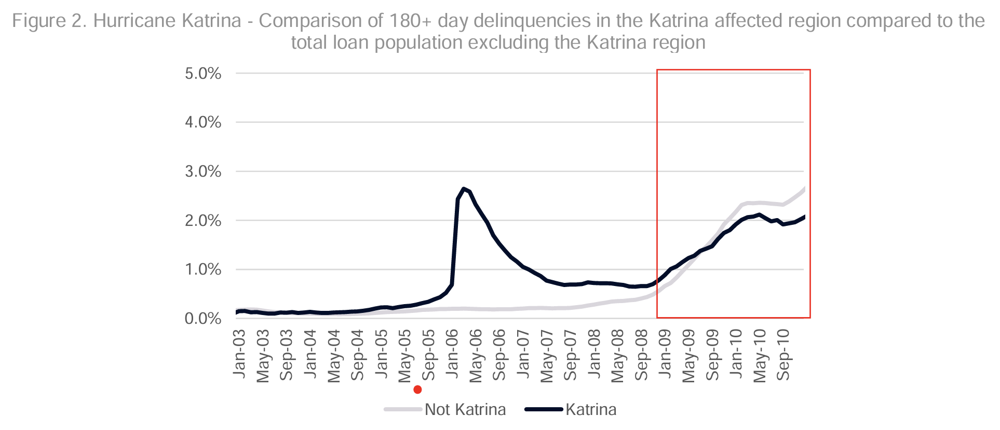
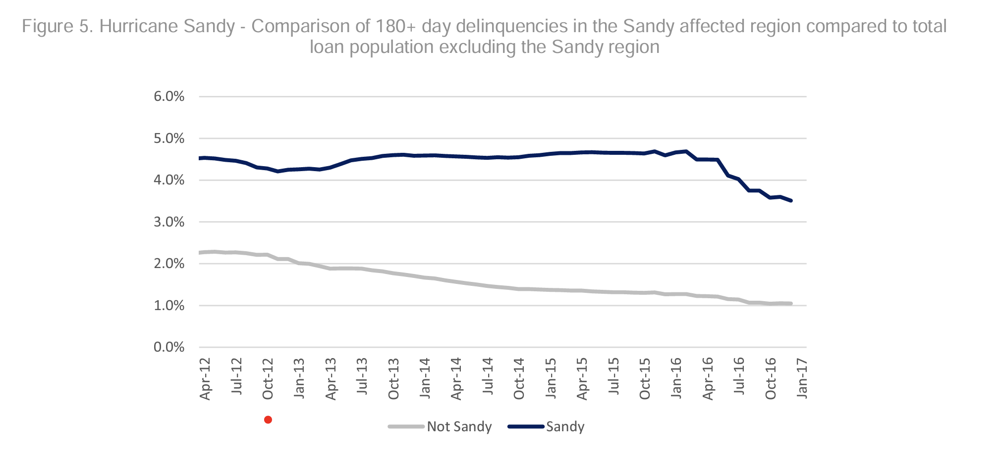

### Context
[ostrich paradox](https://www.google.com/books/edition/The_Ostrich_Paradox/1vU1EAAAQBAJ?hl=en&gbpv=1&printsec=frontcover)
* Costs of disaster relief
  * Betsy, $1.4 Bn 1965,
  * 1964 great alaskan earthquake $116M 1964 dollars
* Flood perils deemed uninsurable after the Great Mississippi flood of 1927, which caused \$200M in direct damage and \$200M in indirect damage
  * [1927 levee destruction](https://chrisdier.com/2014/02/16/when-the-levees-blew-up-a-public-execution-of-a-community/)
[hazards research Gilbert White](https://hazards.colorado.edu/gilbert-f-white/vita)
[Knowles Kunreuther](https://www.cambridge.org/core/journals/journal-of-policy-history/article/troubled-waters-the-national-flood-insurance-program-in-historical-perspective/3F9481EC44EBC8F83AD93A5689E33A14)
* [Andy Horowitz, Betsy Flood Victims](/https://www-jstor-org.ezproxy.bu.edu/stable/pdf/43918106)

* [L. B. J.'s response](https://medium.com/populiteracy/hurricane-betsy-lyndon-b-johnson-and-setting-a-presidential-precedent-9f4d32ed1096#id_token=eyJhbGciOiJSUzI1NiIsImtpZCI6IjkzYjQ5NTE2MmFmMGM4N2NjN2E1MTY4NjI5NDA5NzA0MGRhZjNiNDMiLCJ0eXAiOiJKV1QifQ.eyJpc3MiOiJodHRwczovL2FjY291bnRzLmdvb2dsZS5jb20iLCJhenAiOiIyMTYyOTYwMzU4MzQtazFrNnFlMDYwczJ0cDJhMmphbTRsamRjbXMwMHN0dGcuYXBwcy5nb29nbGV1c2VyY29udGVudC5jb20iLCJhdWQiOiIyMTYyOTYwMzU4MzQtazFrNnFlMDYwczJ0cDJhMmphbTRsamRjbXMwMHN0dGcuYXBwcy5nb29nbGV1c2VyY29udGVudC5jb20iLCJzdWIiOiIxMTEwMTY3OTQxNjc1NDU0MTU1MTciLCJlbWFpbCI6IndjbW9ockBnbWFpbC5jb20iLCJlbWFpbF92ZXJpZmllZCI6dHJ1ZSwibmJmIjoxNzEyNjg3Mzc4LCJuYW1lIjoiV2lsbGlhbSBNb2hyIiwicGljdHVyZSI6Imh0dHBzOi8vbGgzLmdvb2dsZXVzZXJjb250ZW50LmNvbS9hL0FDZzhvY0lsb2JubDFpV0U1T3NCcTFKOFh1c3daSldiMThmamFGMFZxTWx0Nkc4TGctaFZMa2s9czk2LWMiLCJnaXZlbl9uYW1lIjoiV2lsbGlhbSIsImZhbWlseV9uYW1lIjoiTW9ociIsImlhdCI6MTcxMjY4NzY3OCwiZXhwIjoxNzEyNjkxMjc4LCJqdGkiOiIyMzY0MWRkY2EwOWQwNjhmMzM0Y2ExMjA2ZjRjODQwNjEwMjFkODllIn0.ZGjmiety_golqvd3N8lB9D5i9qFFfNDU0V5SutC7Hg9m09eWd6pL2FwHs4ZxCBqaadAlEc_4NCSlA9BnrZlIuDs3Z4v1jlVapybo2AL7p6tnjKyxM-O2OhBRxpBsXcfgxS_wA6nrLY7Qm6rJLOAtlSidY82BLVcI91ZFOGcR09mO0k0xluD0irsRM_iHCuz2xXKy4x1Pl6nsCwb0-RyIKhbO5dgPOngDd2mMCJm9tlk56dVMkTITu2D2-6x5ykRUxxvYLdwVXW8KlB_Wg1Jl5iqQh4XXC35vCWgZKki-pq-1z1_9BjnJEkS1goaH4qvioeb_eQKcfnSwR1l3U6zy0w)
# The National Flood Insurance Act of 1968, As Amended, and The Plood Disaster Protection Act of 1973, As Amended
[text](chrome-extension://efaidnbmnnnibpcajpcglclefindmkaj/https://www.fema.gov/sites/default/files/2020-07/national-flood-insurance-act-1968.pdf)
### Purpose
* Modulate the financial impact of storms on vulnurable communities (citizens, buisinesses, church organizations, etc.)
* Loss mitigation has been insufficient
* Flood insurance is a resonable method for sharing the risks of flood losses.
* Insurance can encourage preventive and protective measures
* An insurance program would foster the government's administrative expertise and concotimant ability to extend coverage on reasonable terms to those at risk of sustaining flood damage.
*  The private sector won't insure for the flood risks, but can administer a government backed program.
*  The program would allow for a unified, nationwide response to flood danger that appropriately disperses and allocates the costs of remediation of financial impacts.
*  equitably distribute burdence among those protected and *the general public*
*  Encourage states to make land-use adjutments, constrict developement of land exposed to flood damage and minimize damage caused by flood losses.
*  "Guide development of proposed future construction away from locations which are threatened by flod hazards"
*  encourage lending, credit institutions to assist in furthering the objectives of the flood insurance program,
*  coordinate federal assistance under the program with all other flood-related programs of the federal government.
*  continue the study of flood hazards, constantly reappraise the flood insurance program and its effects on land use requirements.
*  provide for protection from mudslides caused by accumulations of water on or under the ground.
#### Additional Congressional Findings
*  increasing annual losses from floods and mudslides, largely due to developemnt of, and the concentration of population in, areas of flood and mudslide hazards.
*  Federal loans, grants, guarantees, insurance, and other forms of financial assistance are often determining factors in the utilization of land and the location and construction of public and of private industrial, commercial, and residential facilities
*  Federal assistance applied to construction or acquisition of property in flood-prone areas may be frustrated in its' purpose
*  Federal instrumentalities insure or otherwise provide financial protection to
*  "Federal instrumentalities insure or otherwise provide financial protection to banking and credit instutions whose assets include a substantial number of mortgange loans and other indebtedness secured by property exposed to loss and damage from floods and mudslides"
*  People die and disaster relief benefits are not a sufficiently effective means for mitigating financial consequences.
*  Everyone benefits from persons already living in flood-prone areas to have the opportunity to purchace flood insurance and have access to more adequate limits of coverage, so that they will be indemnified for their losses in the event of future flood disasters.
#### Stated purpose of act
* increase limits of coverage
* survey for flood-prone areas and inform the public
* compel mitigation measures, insurance participation by states and local communties.  Require insurance purchace by those assisted by federal programs or by federally supervised, regulated, or insured institutions in the acquisition or improvement of land or facilities located or to be located in identified areas having special flood hazards.
* Federal agency: notably, Federal National Mortgage Association, Federal Home Loan Mortgage Corporation
* Encourage and arrange risk sharing and other forms of participation by insurance companies.
#### Priorities to...
* one to 4 family residences
* church properties
* properties owned or leased & operated by small businesses
  
#### Relevance to Fannie Mae, government loan & mortgage entities

* Above we see how federal assistance allowed homeowners to pay outstanding mortgage debt.
  
* Without government assistance, mortgage delinquencies remained elevated despite broader economic, housing market recovery.
* 
[Delinquencies in Katrina region, compared to financial crisis](https://www.fanniemae.com/media/24641/display)

# National Flood Insurance Act - Context, Origins, and Impact
## Purpose
* Equitable protection
* Incentives for mitigation
* 
## Origin
### 
* History of property damage, loss of life
* related legislation: Hurricane Protection Program's stronger levee's for New Orleans, designed for fast-moving cat-4 hurricane, fail after huricane Katrina.
* Army corps of engineers vs community [standars](https://www.vox.com/science-and-health/2017/8/28/16211392/100-500-year-flood-meaning).
  
### Hurrican Betsy
* August 27th - Sep. 13th 1965
* First inflation unadjusted billion dollar storm
#### Damage in florida
* 25k telephone poles toppled
* 25-50% destruction of citrus crop
* Crop damage in florida
* $139 Million in damage (1965 \$)
#### Gulf
* Zapata Corp's (G.H.W. Bush) Maverick Oil platform dissapeared, insured by Lloyd's of London for 5.7 Million (1965 \$)
#### Louisiana
* Vic Schiro, mayor of New Orleans, promised federal aid by Lyndon B. Johnson.
*  "Levees for the Mississippi River Gulf Outlet along Florida Avenue in the Lower Ninth Ward and on both sides of the Industrial Canal failed"
*  [dynamite cracks levee legend](https://web.archive.org/web/20070930184657/http://www.nola.com/printer/printer.ssf?%2Fbase%2Fnews-4%2F1134370689216400.xml)
#### Other
* Mississippi: $80M
## Trends
* property value in coastal areas
* 
* Storm intensity

### Aftermath 
* hurricane camille: 1.4 billion in damage, 200 mph max wind speeds

### Further Legislation
* Shore Up CT 
  * Long term, low interest loans for risk mitigation measures [ostrich paradox](https://www.google.com/books/edition/The_Ostrich_Paradox/1vU1EAAAQBAJ?hl=en&gbpv=1&printsec=frontcover)

####
* current vulnerability [cv](https://www.flooddefenders.org/problem)
* [EPA storm info](https://www.epa.gov/climate-indicators/climate-change-indicators-tropical-cyclone-activity#:~:text=According%20to%20the%20total%20annual,during%20the%201950s%20and%201960s.)